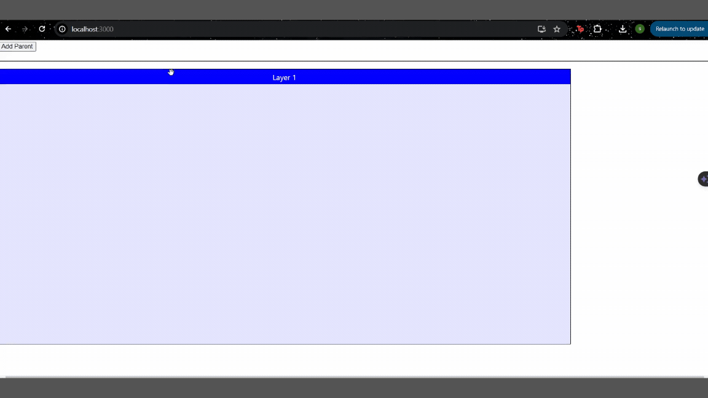

# React Draggable Nested Boxes App

This is a simple React application that demonstrates nested draggable boxes. You can add new parent boxes, and each box can be dragged inside the parent box.

## Features

- Nested draggable boxes
- Each box can be dragged inside parent
- Add new parent boxes dynamically

## Installation

1. Clone the repository:

   git clone https://github.com/sh9re5ya97/ReactDragBoxApp.git
   cd react-drag-box-app

2. Install the dependencies:
    npm install

3. Usage:
   Start the development server:

    npm start

4. Open your browser and navigate to http://localhost:3000 to see the app in action.

